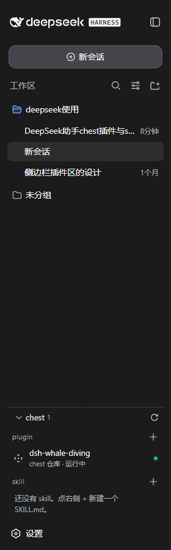
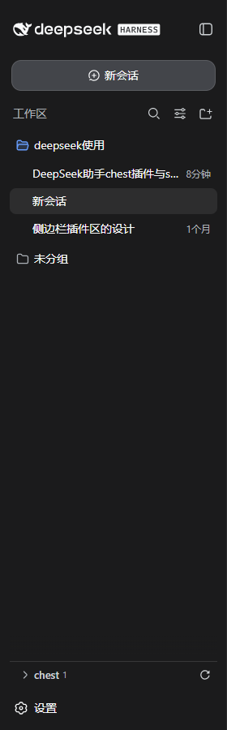
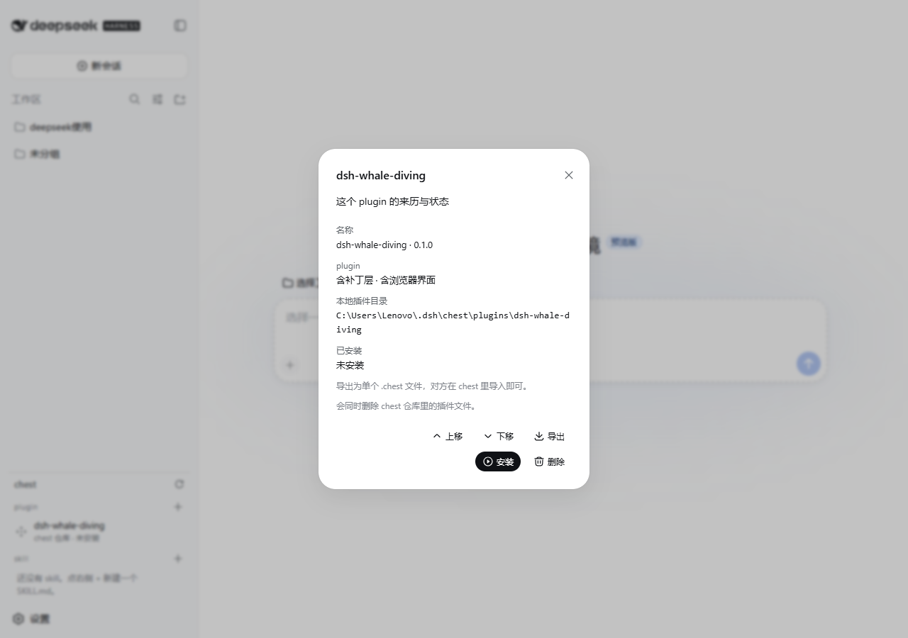
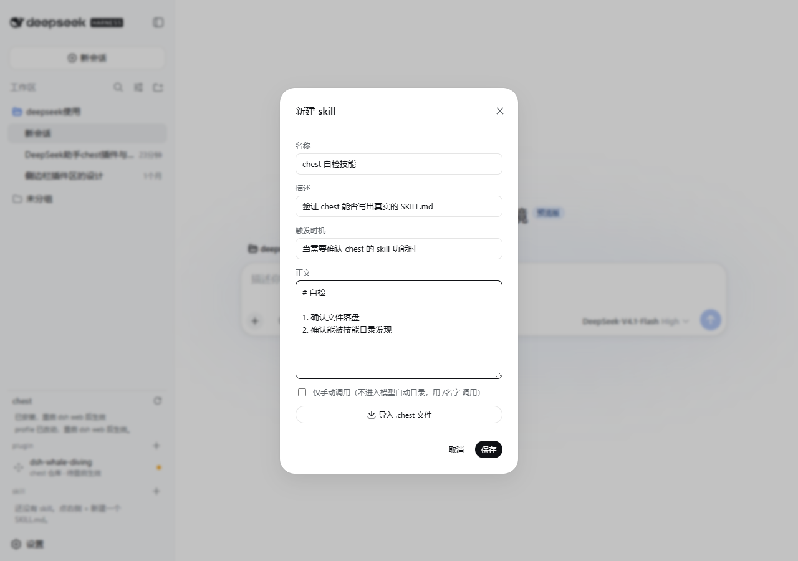

# chest · DeepSeek Harness 的插件与技能仓库

> **合集**：本项目是 [**DSH Collection**](https://github.com/ZeroCode321/dsh-collection) 的第 02 号项目（插件管理类）。合集里还有 `dsh-workspace-menu`（侧栏行菜单）与 `dsh-whale-diving`（鲸鱼动画）。


> 侧边栏里的一个折叠区，管真实的东西：能装进 profile 的**插件包**，和能被技能目录发现的 **SKILL.md**。
> 新增、删除、排序、导出成一个文件分享——全部是可验证的文件操作，不是"给模型的一段文字"。

<p align="center">
  
  
</p>

本文档面向两类读者：想直接用的人（[快速开始](#快速开始)），和想读代码/继续改的人（[架构](docs/architecture.md)、[插件与技能编写](docs/authoring.md)）。

---

## 目录

- [它解决什么问题](#它解决什么问题)
- [功能](#功能)
- [快速开始](#快速开始)
- [仓库结构](#仓库结构)
- [数据落在哪里](#数据落在哪里)
- [`.chest` 分享格式](#chest-分享格式)
- [验证](#验证)
- [兼容性与已知限制](#兼容性与已知限制)
- [许可与归属](#许可与归属)
- [English summary](#english-summary)

---

## 它解决什么问题

DeepSeek Harness（下称 DSH）的侧边栏原本有个「插件」区，但它管的是**文本指令**：一条名称、一句描述、一段插入输入框的提示词。这有两个后果：

1. **它不是插件。** 你从别处下载的插件包、你自己写的客户端插件，都不会出现在那里，因为它只认自己目录下的 `.md` / `.json` 指令文件。
2. **它没法"管理"。** 装一个插件在 DSH 里意味着改 profile：加依赖、把包名加进 bundle 层列表、在 `node_modules` 里建立链接——这三件事原来只能手改配置文件。

chest 把这件事做成界面：**plugin 分区**列真实的插件包，安装就是把上面三处一次性写好；**skill 分区**直接读写用户技能根目录的 `SKILL.md`，写进去就是真技能（`/技能名` 与 `skill` 工具立刻能用）。两类东西都能排序、能导出成一个文件交给别人。

---

## 功能

| | plugin 分区 | skill 分区 |
| --- | --- | --- |
| 管理对象 | 插件包目录：`package.json` + `cordis.patch.yml`，可选浏览器半边 | `SKILL.md`（目录包或平铺单文件） |
| 新增 | 填本地目录路径（就地登记）；或导入 `.chest` 文件（复制进 chest 仓库） | 表单新建；或导入 `.chest` |
| 安装 | 真的改 profile：`dsh.profile.bundles` 追加、`link:` 依赖、`node_modules` 目录链接 | 不需要安装 |
| 卸载 | 上述三处的逆操作 | — |
| 排序 | 改 bundle 层顺序，即真实的补丁层优先级 | 只影响 chest 里的列出顺序 |
| 导出 | 一个 `.chest` 单文件，含全部文件（含预构建的 `lib/client.js`） | 一个 `.chest`（含附带资源） |
| 删除 | 先卸载，再删 chest 仓库里的文件 | 删 `SKILL.md`（或整个技能目录） |
| 状态显示 | 运行中（绿点）/ 已安装待重启（黄点）/ 未安装 | 描述、附属文件数、是否仅手动调用 |

界面约定：

- **折叠区**：点标题展开 `plugin` 与 `skill`，默认收好；选择存在浏览器 `localStorage` 的 `dsh.chest.expanded`。收好时仍显示条目数与"待重启"提示（这类信号藏在折叠里等于没有）。
- **无 emoji**：所有图形都是图标原子（icon atom），文案里没有任何 emoji。
- **行点击开对话框**：动作（安装/卸载、上移/下移、导出、删除）都在对话框里，因为侧边栏一列挂不下五个按钮。
- **删除两步确认**：第一次点变成「确认删除」，几秒后自动复位。
- **`@` 菜单**：技能落 `/技能名`（走真实技能管线），插件落它的包目录（插件是代码，交给 agent 去改比假装"调用"更实在）。

<p align="center">
  
  
</p>

---

## 快速开始

前置：一份 DSH 源码 checkout（本补丁针对 `deepseek-harness` 的 monorepo 结构），Node 22+，pnpm。

### 1. 应用补丁

```powershell
git -C <你的 deepseek-harness 路径> checkout -b chest
git -C <你的 deepseek-harness 路径> am <本仓库>/patches/*.patch
```

补丁分四个提交，可单独审查或摘取：

| 补丁 | 内容 |
| --- | --- |
| `0001-feat-chest-host-side-plugin-and-skill-vault` | Host 端 chest 网关（13 个 Remote 方法）、api-remotes / apiproxy 接线、tsconfig 路径映射 |
| `0002-feat-chest-sidebar-chest-section-source-and-.chest-s` | 浏览器端 chest 分区、`@` 触发源、`.chest` 导出/导入、sidebar 槽位 |
| `0003-feat-conversation-declare-a-turn-status-icon-seat-an` | 对话流声明 `conversation.chat.turnStatusIcon` 槽位；鲸鱼从内置清单移出 |
| `0004-chore-deps-lockfile-for-the-chest-packages` | 锁文件 |

也可以只抄代码：`packages/` 下的两个包就是完整源码，`packages/bundle/web-app/cordis.patch.yml` 里那两行（`plugin-shelf`、`ui-plugin-shelf`）是必须加的浏览器花名册行。

### 2. 构建并重启

```powershell
cd <你的 deepseek-harness 路径>
npm run build:lib:host
npm run build:lib:client
# 然后重启 dsh web
```

> 为什么必须重启：Loader 在启动时把 bundle 层组合好，浏览器花名册也只扫描一次并缓存每个包的判定结果。**安装/卸载/排序插件同样需要重启**——chest 会把这件事写在界面上，而不是假装已经生效。

### 3. 装一个插件（以鲸鱼为例）

`plugins/dsh-whale-diving/` 是一个完整的独立插件包，不依赖 chest 也能用：

```powershell
# 复制到任意位置，然后登记到 profile
$dst = "$env:USERPROFILE\.dsh\chest\plugins\dsh-whale-diving"
Copy-Item -Recurse <本仓库>\plugins\dsh-whale-diving $dst
```

然后在 chest 的 `plugin` 分区：`+` → 粘贴目录路径 → 添加目录 → 点该行 → 安装 → 重启 dsh web。
效果：对话流"运行中"状态旁边多一只下潜的鲸鱼；卸载后恢复纯文字。

### 4. 写一个技能

chest 的 `skill` 分区：`+` → 填名称/描述/触发时机/正文 → 保存。
文件会写到 `~/.dsh/skills/<slug>/SKILL.md`，立刻可以被 `/技能名` 调用，也会进入 `skill` 工具的目录。

---

## 仓库结构

```
patches/                          可 git am 的补丁系列（四个提交）
packages/host/plugin-shelf/       Host 端 chest 网关（TypeScript，含单测）
packages/client/ui-plugin-shelf/  浏览器端 chest 分区（React + CSS Module，含单测）
plugins/dsh-whale-diving/         示例插件：一只鲸鱼（含预构建 lib/client.js）
examples/                         `.chest` 分享文件示例（插件一个、技能一个）
scripts/                          应用补丁、跑门检、无头验收的脚本
docs/architecture.md              数据模型、Remote 接口、安装机制、设计决策
docs/authoring.md                 怎么写插件包与技能、怎么调试
docs/verification.md              测试与实测报告（含复现步骤）
docs/screenshots/                 界面截图
```

---

## 数据落在哪里

| 路径 | 谁写 | 是什么 |
| --- | --- | --- |
| `$DSH_HOME/chest/chest.json` | chest | 记账：登记的外部插件目录、两个分区的顺序、待重启标记 |
| `$DSH_HOME/chest/plugins/<id>/` | chest | chest 自己拥有的插件包 |
| `$DSH_HOME/skills/<slug>/SKILL.md` | chest 写，`skill-filesystem` 读 | 真实技能根目录 |
| `$DSH_HOME/profiles/<name>/package.json` | chest 改 | bundle 层顺序；安装/卸载/排序改的就是它 |
| `$DSH_HOME/profiles/<name>/node_modules/<pkg>` | chest 建 | 指向插件包的目录链接 |

---

## `.chest` 分享格式

一个 JSON 文档，装下整个插件包或技能目录，别人在 chest 里导入即可。

```json
{
  "format": "dsh-chest",
  "revision": 1,
  "kind": "plugin",
  "id": "dsh-whale-diving",
  "name": "dsh-whale-diving",
  "description": "鲸鱼下潜动画：在对话流的运行中回合状态旁画一只下潜的小鲸鱼",
  "createdAt": 1787212345678,
  "files": [
    { "path": "package.json", "encoding": "utf8", "content": "{\n  \"name\": ..." },
    { "path": "lib/client.js", "encoding": "utf8", "content": "window.__ModuleLoader__.load({ ..." }
  ]
}
```

设计取舍：

- **单文件**，所以分享 = 发一个附件，不用打 zip、不用担心目录结构丢失。
- **每个文件自带编码**：能当 UTF-8 文本读的回 `utf8`，其余 `base64`（二进制资源不会坏）。
- **导入端做安全校验**：`format`/`revision` 必须匹配，`kind` 必须是 `plugin` 或 `skill`，每条路径拒绝绝对路径、盘符、`..`、`node_modules`，任何越界都会在写盘前失败并回滚。

示例在 `examples/`：`dsh-whale-diving.chest`（插件，约 20 KB）与 `sample-skill.chest`（技能）。

---

## 验证

摘要（完整报告与复现步骤见 [docs/verification.md](docs/verification.md)）：

| 检查 | 结果 |
| --- | --- |
| `vitest`：chest host 单测 | 7/7 通过 |
| `vitest`：chest 客户端单测（折叠偏好持久化、文案无 emoji、中英键一致） | 5/5 通过 |
| `vitest`：sidebar / api-remotes（受影响的下游） | 26/26 通过 |
| `verify-export-jsdoc`（每个导出都要有 `@param`/`@returns`） | 通过 |
| `verify-package-invariants` / `verify-built-package-invariants` | 通过（221 个包） |
| `verify-cordis-config`（Loader 行与包解析） | 通过 |
| `knip`（未用依赖与未用代码） | 通过 |
| 两个 README 文档门（Model Experience / Limitations） | 通过 |
| `oxlint`（含类型感知规则） | 0 警告 0 错误 |
| 端到端（第二个 `dsh web` 实例，Playwright + Edge） | 见下表 |

端到端实测：

| 场景 | 实测结果 |
| --- | --- |
| 侧边栏渲染 | `chest` 标题、`plugin`/`skill` 两个分区、状态点正确 |
| 折叠 | 首次打开是收好的；点标题展开；刷新后仍展开（`localStorage` 生效）；再点收起 |
| 插件安装 | 对话框点安装后，profile 的 `package.json` 出现 `link:` 依赖与 bundle 项、`node_modules` 出现目录链接；界面状态变为「已安装 · 待重启生效」 |
| 重启后生效 | 新实例的 `window.__DSH_BOOT__` 含 `dsh-whale-diving`，`/plugins/dsh-whale-diving/client.js` 由服务器伺服，插件行显示「运行中」，且其 CSS 注入痕迹证明浏览器模块真的执行了 |
| 技能闭环 | 界面新建的技能出现在 `/` 菜单里（= 真技能）；导出 `.chest` → 删除 → 再导入，正文完好 |
| 排序 | 上移后界面顺序与 `chest.json` 落盘顺序一致 |
| 分享 | 插件导出为 19 KB 的 `.chest`（含 `lib/client.js` 等 10 个文件） |
| 控制台 | 全程 0 报错、0 失败请求 |

---

## 兼容性与已知限制

- **改动的是 fork，不是插件**：chest 需要 DSH monorepo 内部接线（sidebar 槽位、api-remotes 装配、tsconfig 路径映射），因此以补丁系列交付，而不是 npm 包。上表中最后一个补丁是锁文件洞。
- **重启才生效**：安装/卸载/排序插件后需要重启 `dsh web`。这是 DSH 的 Loader 与浏览器花名册的启动期语义，chest 选择如实告知。
- **不做依赖解析**：安装只写 `link:` 依赖、bundle 项与目录链接，不跑包管理器。插件若自身有依赖，需要自带或手工安装。
- **技能只管理用户根目录**：`$DSH_HOME/skills` 可写；项目根 `.dsh/skills`、`.agents/skills`、`~/.agents/skills` 只读。
- **改名不改目录名**：技能改名只改 `SKILL.md` 的 `name`（也就是调用名），目录 slug 保持创建时的值。
- **chest 只列自己管的插件**：仓库里的自动出现；你手工装过的插件（例如用 `link:` 手改 profile 装的）需要点一次「添加目录」登记，之后安装状态、运行状态、导出、删除都可用。
- **上游既存问题一例**：`verify-client-domain-graph` 在本 checkout 上报 27 处违规，全部位于 `runtime/contract`、`ui-conversation/skeleton`、`ui-input-trigger`、`ui-workspace` 等**本改动未触碰**的目录，与本仓库内容无关。
- **内部命名保留上游风格**：服务名仍是 `pluginShelf`、槽位仍是 `sidebar.plugins`、包目录仍是 `plugin-shelf` / `ui-plugin-shelf`。用户可见的地方叫 chest；改这些要重生成跨包 typert 描述符，收益为零、风险不小。

---

## 许可与归属

- 本仓库内容（chest 两个包、鲸鱼插件、脚本与文档）：MIT，见 [LICENSE](LICENSE)。
- 补丁应用于 **DeepSeek Harness**（MIT，Copyright (c) 2026 DeepSeek，<https://github.com/deepseek-ai/deepseek-harness>）。本仓库不包含该项目的源代码，只包含针对它的差量与自研代码；上游许可与归属见 [NOTICE](NOTICE)。

---

## English summary

**chest** turns the DeepSeek Harness sidebar's plugin area into a real vault. It manages two kinds of artifact: **plugin packages** (a directory with `package.json`, a `cordis.patch.yml` layer and an optional browser half) that it can install into the booted profile — a `link:` dependency, the bundle entry in `dsh.profile.bundles`, and the `node_modules` link — and **skills**, written as `SKILL.md` under the user skill root so the harness's own provider discovers them at once. Both reorder, delete, and export to a single shareable `.chest` document, and both import back.

Ships as a four-commit patch series against the DSH monorepo, plus the source of both packages, a standalone example plugin (`dsh-whale-diving`), the verification scripts and the screenshots. Installing, uninstalling and reordering a plugin are real composition changes and apply on the next restart, which the UI states plainly instead of pretending otherwise.
